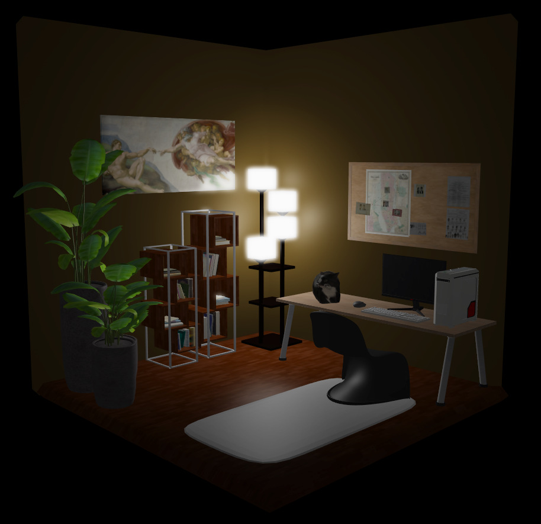
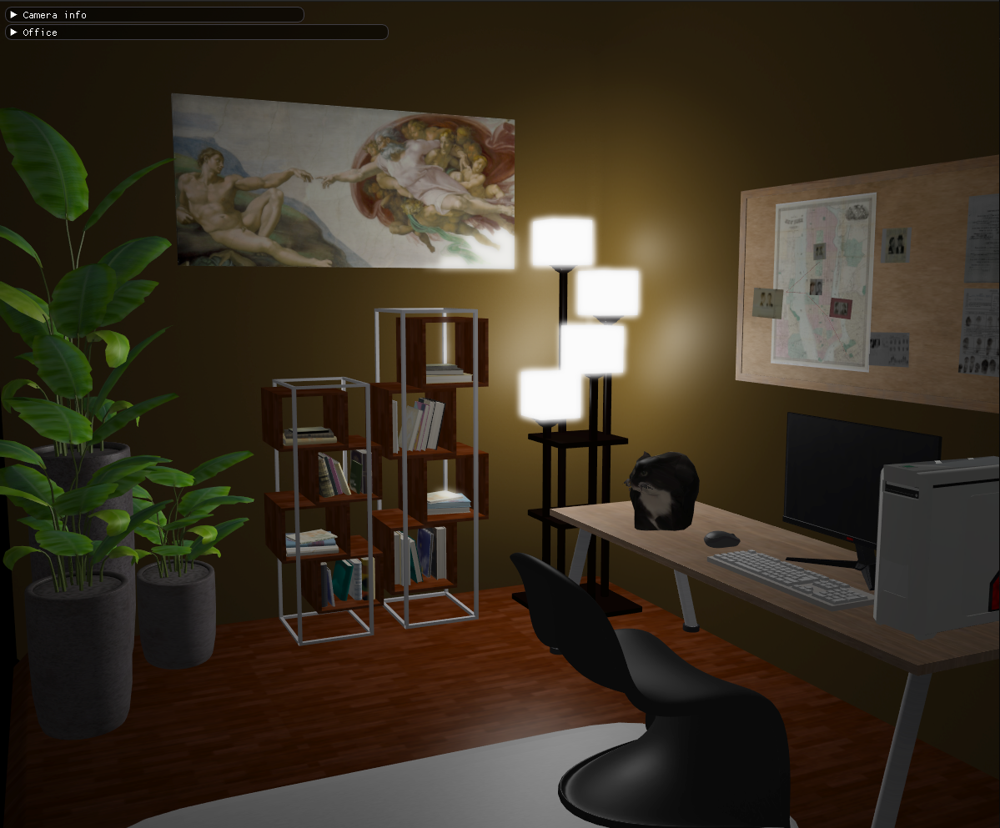

# Modern office 
> Project for Computer Graphics course using OpenGL
>
> [Demo video](https://www.youtube.com/watch?v=G6pFzjSX3lw)
## Controls
- **WASD** - camera movement

- **MOUSE SCROLL** - zoom in/zoom out

- **SPACE** - bloom off/bloom on

- **R** - hold for Maxwell dance

- **F1** - ImGui

## Implemented lessons

- Group A : **Anti-Aliasing and Framebuffers**
- Group B : **HDR and Bloom**

## Resources and credits

- The room was made in Blender.

 Models used:

- [Plants](https://www.blenderkit.com/asset-gallery-detail/145f4caf-1164-4390-b8a0-ec36a928d147/)
- [Picture](https://www.blenderkit.com/asset-gallery-detail/4052d1c2-76bf-43a1-9658-873e7fc24284/)
- [Lamp](https://www.blenderkit.com/asset-gallery-detail/77d725b6-e497-4247-9fa6-8d192d9bd9b2/)
- [Chair](https://www.blenderkit.com/asset-gallery-detail/488ca455-2f23-4cd0-aef3-52d5d57579a3/)
- [Table](https://www.blenderkit.com/asset-gallery-detail/50b8ae01-ba95-4bfa-a87e-36931d246077/)
- [Mouse](https://www.blenderkit.com/asset-gallery-detail/f8436d7d-800c-4bc1-b1cf-28c72f7315ee/)
- [Corkboard](https://skfb.ly/6XvvH) by Glowbox 3D is licensed under [Creative Commons Attribution](http://creativecommons.org/licenses/by/4.0/).
- [Cat](https://skfb.ly/oAtMJ) by bean(alwayshasbean) is licensed under [Creative Commons Attribution](http://creativecommons.org/licenses/by/4.0/).
- [Keyboard](https://skfb.ly/opWnJ) by Arnau Rocher Alcayde is licensed under [Creative Commons Attribution](http://creativecommons.org/licenses/by/4.0/).
- [Monitor](https://skfb.ly/o8vT7) by Turtle_Flipper is licensed under [Creative Commons Attribution](http://creativecommons.org/licenses/by/4.0/).
- [Computer](https://skfb.ly/6Cs9Q) by JohanKL is licensed under [Creative Commons Attribution](http://creativecommons.org/licenses/by/4.0/).
- [Bookcase](https://skfb.ly/oBUOJ) by 3D_for_everyone is licensed under [Creative Commons Attribution](http://creativecommons.org/licenses/by/4.0/).

## Pictures

    

    

